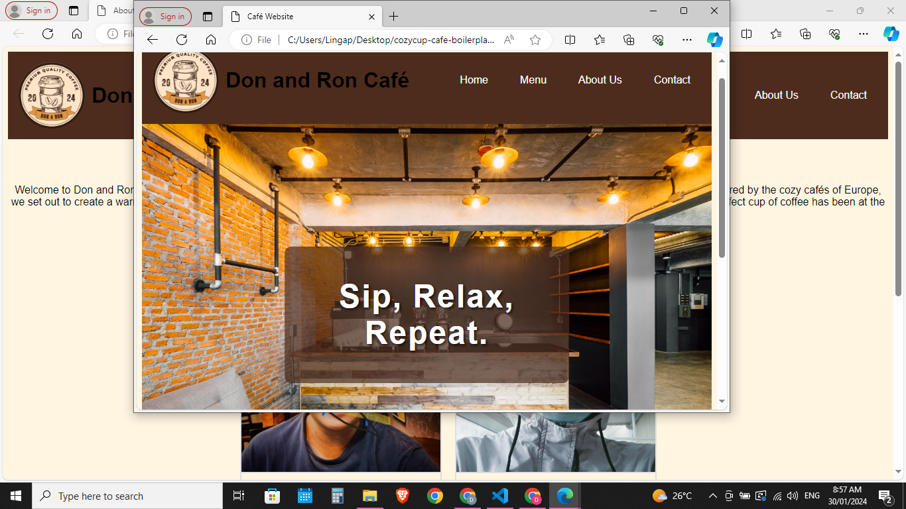

# Cozy Cup Cafe

## Project Description
The Don and Ron Café Website project aims to create an engaging and user-friendly online platform for Don and Ron Café, a cozy coffee shop known for its warm ambiance and quality coffee blends. The website will serve as a digital storefront for the café, providing visitors with information about the café's menu, story, team members, and contact details.

## Features
- **Responsive Design**: The website is designed to be fully responsive, ensuring optimal viewing and interaction across various devices and screen sizes.
- **Navigation Menus**: A user-friendly navigation menu allows visitors to easily navigate between different sections of the website, including the homepage, menu, about us, and contact page.
- **Homepage Hero Section**: The homepage features a captivating hero section with an inviting image of the café's interior and a catchy tagline ("Sip, Relax, Repeat"), setting the tone for the café's ambiance and atmosphere.
- **Menu Showcase**: The website showcases the café's menu offerings, including popular coffee blends and pastries, with appealing visuals, descriptions, and prices to entice visitors.
- **About Us Page**: An engaging about us page provides visitors with insights into the café's story, origins, values, and commitment to providing a welcoming environment for coffee enthusiasts.
- **Meet the Team Section**: The website introduces visitors to the café's team members through a "Meet the Team" section, featuring photos and short bios of the café owner and staff, fostering a sense of familiarity and connection with the café.
- **Contact Information and Form**: Contact information, including the café's address, phone number, and email, is prominently displayed on the website, along with a contact form that allows visitors to reach out for inquiries, reservations, or feedback.
- **Social Media Integration**: The website includes links to the café's social media profiles, allowing visitors to stay updated on the latest news, promotions, and events from Don and Ron Café.
## Screen Captures

### 1. Responsive Design

Ensures seamless viewing and interaction across all devices.

### 2. Navigation Menu

Facilitates easy navigation between website sections.

### 3. Homepage Hero Section

Captivates visitors with an inviting café ambiance and catchy tagline.

### 4. Menu Showcase

Highlights café offerings with enticing visuals and descriptions.

### 5. About Us Page

Provides insights into the café's story, values, and mission.

### 6. Meet the Team Section
 Introduces café staff members through bios and photos.

### 7. Contact Information and Form

Enables visitors to reach out for inquiries and reservations.

### 8. Social Media Integration

Connects visitors with the café's social media profiles for updates.

## About the Authors

**Names:** Don Salvatierra and Ron Agum

**Email:** Your Email

